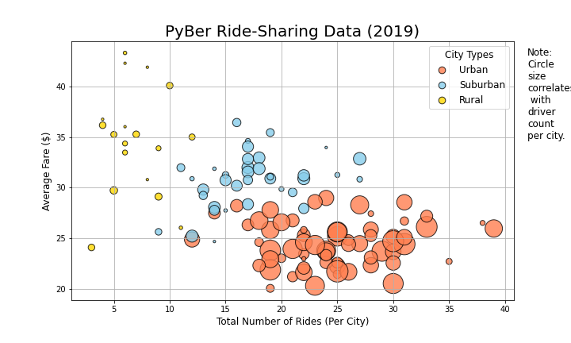
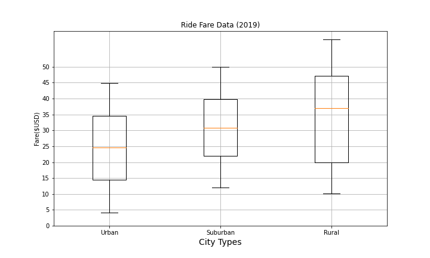
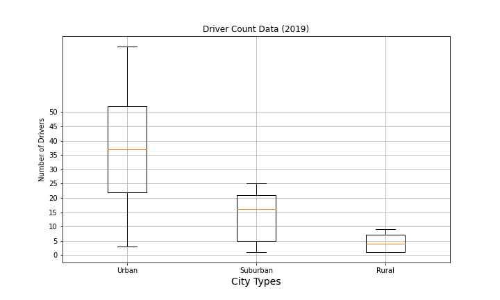
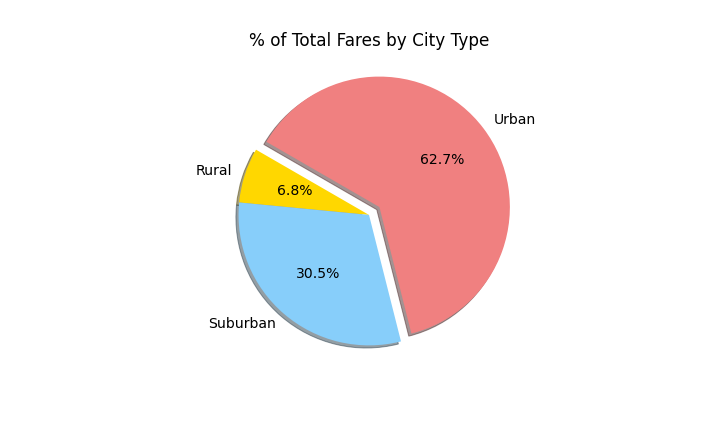
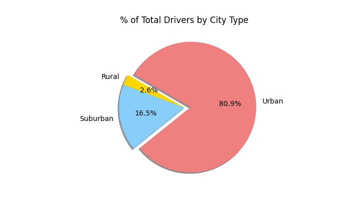

# PyBer_Analysis
Module 5

# Project Overview
The purpose of this project is to perform exploratory analysis on data for a rideshare company called PyBer in different type of city including urban, suburban and rural. This report summary will help visualize the company on the demand for rides and drivers, as well as in making decisions and estimating future rates and plans.

## Resources
Data Source: ride_data.csv, city_data.csv

Software: Python 3.9.0, Anaconda Navigator 2.1.1, Jupyter Notebook 6.4.6

## Results (Module 5)
- Create a bubble chart that showcases the average fare versus the total number of rides with bubble size based on the total number of drivers for each city type, including urban, suburban, and rural.

- Determine the mean, median, and mode for the following:
  - The total number of rides for each city type.
    - Urban: 1625 rides
    - Suburban: 625 rides
    - Rural: 125 rides
     
  - The average fares for each city type.
    - Urban: $24.53
    - Suburban: $30.97
    - Rural: $34.62
    
  - The total number of drivers for each city type.
    - Urban: 2405 drivers
    - Suburban: 490 drivers
    - Rural: 78 drivers

The analysis shows that the total number of rides in rural cities is 13 to 5 times less per city than in urban and suburban cities, respectively. However, the average fare for rides in the rural cities is about $11 and $5 more per ride than the urban and suburban cities, respectively. This may be due to demand, as there are fewer drivers in rural cities compared to other types of cities.

- Create box-and-whisker plots that visualize each of the following to determine if there are any outliers:
  - The number of rides for each city type.
  
  
  - The fares for each city type.
  
  
  - The number of drivers for each city type.
  
  
- Create a pie chart that visualizes each of the following data for each city type:
  - The percent of total fares.
  
  
  - The percent of total rides.
  
  
  - The percent of total drivers. 
  

The 
# Challenge Overview
Create a summary DataFrame of the ride-sharing data by city type. Then, using Pandas and Matplotlib, create a multiple-line graph that shows the total weekly fares for each city type.
